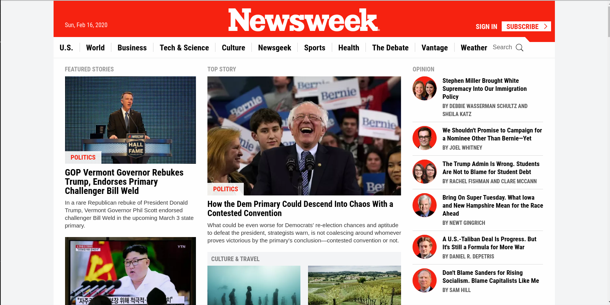

# news-week-clone ([The Odin Project](https://www.theodinproject.com/courses/html5-and-css3/lessons/using-bootstrap))

This is the second Solo project of the Main HTML/CSS curriculum at [Microverse](https:www.microverse.org/) - @microverseinc. 

It is a clone of the news week ([website](https://www.newsweek.com/)) page: 

## Built With

- HTML5 
- CSS3

## Live Demo

[Live Demo Link](https://sleepy-hoover-a0d80e.netlify.com/)

## Author

👤 **Kelly Booster**

- Github: [@kelibst](https://github.com/kelibst)
- Twitter: [@keli_booster](https://twitter.com/keli_booster)
- Linkedin: [Kekeli (Jiresse) Dogbevi
](https://www.linkedin.com/in/kekeli-dogbevi-958272108/)

## 📝 License

This project is [MIT](https://opensource.org/licenses/MIT) licensed.

